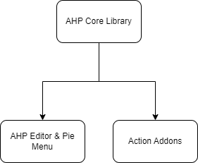

# Project Architecture
AutoHotPie V3 as a whole contains 3 main components: the editor & pie menu, the action addons, and the core library.

The following image illustrates the relationship between the components:

i.e. AHP Core Library is the interface that defines the communication between the editor and the action addons.
